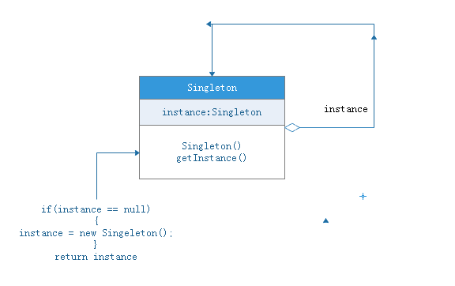

> JAVA设计模式-单例模式

# 一、单例模式

## 1、概念

> 单例模式的定义就是确保某一个类只有一个实例，并且提供一个全局访问点。属于设计模式三大类中的创建型模式。

单例模式具有典型的三个特点：

- 只有一个实例。
- 自我实例化。
- 提供全局访问点。

其**UML**结构图非常简单，就只有一个类，如下图：



优点：由于单例模式只生成了一个实例，所以能够节约系统资源，减少性能开销，提高系统效率，同时也能够严格控制客户对它的访问。

缺点：也正是因为系统中只有一个实例，这样就导致了单例类的职责过重，违背了“单一职责原则”，同时也没有抽象类，这样扩展起来有一定的困难。


## 2、实现

常见的单例模式实现方式有五种：

- 饿汉式
- 懒汉式
- 双重检测锁式
- 静态内部类式
- 枚举单例

### 2.1、饿汉式：

```java
package com.example;

public class singleton_test {
    private static singleton_test instance = new singleton_test();
    private singleton_test(){ }
    public static singleton_test getInstance() {
        return instance;
    }
}
```

**是否 Lazy 初始化：**是

**是否多线程安全：**否

**实现难度：**易

优点：没有加锁，执行效率会提高。
缺点：类加载时就初始化，浪费内存。
它基于 classloader 机制避免了多线程的同步问题，不过，instance 在类装载时就实例化，虽然导致类装载的原因有很多种，在单例模式中大多数都是调用 getInstance 方法， 但是也不能确定有其他的方式（或者其他的静态方法）导致类装载，这时候初始化 instance 显然没有达到 lazy loading 的效果。


### 2.2、懒汉式：

```java
package com.example;
public class singleto_test2 {
    private static singleto_test2 Instance=null;
    private singleto_test2(){}
    public static singleto_test2 getInstance() {
        if (Instance==null){
            Instance=new singleto_test2();
        }
        return Instance;
    }
}
```

**是否 Lazy 初始化：**是

**是否多线程安全：**否

**实现难度：**易

**描述：**这种方式是最基本的实现方式，这种实现最大的问题就是不支持多线程。因为没有加锁 synchronized，所以严格意义上它并不算单例模式。这种方式 lazy loading 很明显，不要求线程安全，在多线程不能正常工作。由于该模式是在**运行时加载对象**的，所以加载类比较快，但是对象的获取速度相对较慢，且线程不安全。如果想要线程安全的话可以加上`synchronized`关键字，但是这样会付出惨重的效率代价。

线程不安全测试

```java
//singleto_test2.java
package com.example;
public class singleto_test2 {
    private static singleto_test2 Instance = null;
    private singleto_test2() { }
    public static singleto_test2 getInstance()  {
        if (Instance==null) {
            try {
                Thread.sleep(50);
                Instance=new singleto_test2();
            } catch (InterruptedException e) {
                e.printStackTrace();
            }
        }
        return Instance;
    }
}
```

```java
//test.java
package com.example;
public class test {
    public static void main(String[] args)  {

        for (int i = 0; i < 30; i++) {
            Thread test = new Thread(new MyThread());
            test.start();
        }
    }
}
class MyThread extends Thread {
    @Override
    public void run() {
        singleto_test2 instance = singleto_test2.getInstance();
        System.out.println(instance);
    }
}
```

运行结果如图所示：


### 2.3、懒汉式，线程安全

```java
package com.example;
public class singleto_test2 {
    private static singleto_test2 Instance=null;
    private singleto_test2(){}
    public static synchronized singleto_test2 getInstance() {
        if (Instance==null){
            Instance=new singleto_test2();
        }
        return Instance;
    }
}
```

**是否 Lazy 初始化：**是

**是否多线程安全：**是

**实现难度：**易

**描述：**这种方式具备很好的 lazy loading，能够在多线程中很好的工作，但是，效率很低，99% 情况下不需要同步。
优点：第一次调用才初始化，避免内存浪费。
缺点：必须加锁 synchronized 才能保证单例，但加锁会影响效率。
getInstance() 的性能对应用程序不是很关键（该方法使用不太频繁）。


### 2.4、懒汉式（双重同步锁）:

```java
package com.example;

public class singleto_test2 {
    private static volatile singleto_test2 Instance = null;
    private singleto_test2() { }
    public static singleto_test2 getInstance()  {
        if (Instance==null) {
            synchronized(singleto_test2.class){
                if (Instance==null){
                    Instance=new singleto_test2();
                }
            }
        }
        return Instance;
    }
}
```

**是否 Lazy 初始化：**是

**是否多线程安全：**是

**实现难度：**较复杂

**描述：**这种方式采用双锁机制，安全且在多线程情况下能保持高性能。
getInstance() 的性能对应用程序很关键。


### 2.5、登记式/静态内部类

```java
package com.example;
public class singleton_test3 {
    private static class SingletonHolder {
        private static final singleton_test3 INSTANCE = new singleton_test3();
    }
    private singleton_test3 (){}
    public static final singleton_test3 getInstance() {
        return SingletonHolder.INSTANCE;
    }
}
```

**是否 Lazy 初始化：**是

**是否多线程安全：**是

**实现难度：**一般

**描述：**这种方式能达到双检锁方式一样的功效，但实现更简单。

对静态域使用延迟初始化，应使用这种方式而不是双检锁方式。这种方式只适用于静态域的情况，双检锁方式可在实例域需要延迟初始化时使用。
这种方式同样利用了 classloader 机制来保证初始化 instance 时只有一个线程，它跟第 1种方式不同的是：第 1 种方式只要 Singleton 类被装载了，那么 instance 就会被实例化（没有达到 lazy loading 效果），而这种方式是 Singleton 类被装载了，instance 不一定被初始化。因为 SingletonHolder 类没有被主动使用，只有通过显式调用 getInstance 方法时，才会显式装载 SingletonHolder 类，从而实例化 instance。想象一下，如果实例化 instance 很消耗资源，所以想让它延迟加载，另外一方面，又不希望在 Singleton 类加载时就实例化，因为不能确保 Singleton 类还可能在其他的地方被主动使用从而被加载，那么这个时候实例化 instance 显然是不合适的。这个时候，这种方式相比第 1 种方式就显得很合理。

### 2.6、enum

```java
package com.example;
public enum singleton_test4 {
    INSTANCE;
    public static singleton_test4 getInstance() {
        return INSTANCE;
    }
}

```

**是否 Lazy 初始化：**否

**是否多线程安全：**是

**实现难度：**易

**描述：**这种实现方式还没有被广泛采用，但这是实现单例模式的最佳方法。它更简洁，自动支持序列化机制，绝对防止多次实例化。
这种方式是 Effective Java 作者 Josh Bloch 提倡的方式，它不仅能避免多线程同步问题，而且还自动支持序列化机制，防止反序列化重新创建新的对象，绝对防止多次实例化。不过，由于 JDK1.5 之后才加入 enum 特性，用这种方式写不免让人感觉生疏，在实际工作中，也很少用。
不能通过 reflection attack 来调用私有构造方法。


## 3、场景

- 网站计数器。 
- 项目中用于读取配置文件的类。
- 数据库连接池。因为数据库连接池是一种数据库资源。
- Spring中，每个`Bean`默认都是单例的，这样便于Spring容器进行管理。
- Servlet中`Applicatio
- Windows中任务管理器，回收站。

## 4、深度研究序列化问题

修改第一个恶汉模式的代码如图所示

```java
package com.example;
import java.io.Serializable;
public class singleton_test implements Serializable {
    ...
}
```

测试代码

```java
package com.example;
import java.io.*;
public class test {
    public static void main(String[] args) throws IOException, ClassNotFoundException {
        singleton_test instance = singleton_test.getInstance();
        ObjectOutputStream oos = new ObjectOutputStream(new FileOutputStream("text.txt"));
        oos.writeObject(instance);
        File file = new File("text.txt");
        FileInputStream fis = new FileInputStream(file);
        ObjectInputStream ois = new ObjectInputStream(fis);
        singleton_test newInstance = (singleton_test) ois.readObject();
        System.out.println(instance);
        System.out.println(newInstance);
    }
}
```

结果如图所示：


反序列化的结果显示与原对象不同

我们进入源码查看


可以看到最后读取的时候是new了一个对象出来

同时enum可以完美的解决这个问题。

```java
package com.example;


import java.io.*;

public enum singleton_test4 {
    INSTANCE;
    public static singleton_test4 getInstance() {
        return INSTANCE;
    }
    public static void main(String[] args) throws IOException, ClassNotFoundException {
        singleton_test4 instance = singleton_test4.getInstance();
        ObjectOutputStream oos = new ObjectOutputStream(new FileOutputStream("text.txt"));
        oos.writeObject(instance);
        File file = new File("text.txt");
        FileInputStream fis = new FileInputStream(file);
        ObjectInputStream ois = new ObjectInputStream(fis);
        singleton_test4 newInstance = (singleton_test4) ois.readObject();
        System.out.println(instance.hashCode());
        System.out.println(newInstance.hashCode());
    }
}

```

结果输出为

```java
/Library/Java/JavaVirtualMachines/jdk1.8.0_192.jdk/Contents/Home/bin/java -javaagent:/Appl...
1360875712
1360875712

Process finished with exit code 0
```


## 5、深度研究反射问题

```java
package com.example;

import java.io.*;
import java.lang.reflect.Constructor;
import java.lang.reflect.InvocationTargetException;

public class test {
    public static void main(String[] args) throws NoSuchMethodException, IllegalAccessException, InvocationTargetException, InstantiationException {
        singleton_test s=singleton_test.getInstance();
        singleton_test sUsual=singleton_test.getInstance();
        Constructor<singleton_test> constructor=singleton_test.class.getDeclaredConstructor();
        constructor.setAccessible(true);
        singleton_test sReflection=constructor.newInstance();
        System.out.println(s+"\n"+sUsual+"\n"+sReflection);
        System.out.println("正常情况下，实例化两个实例是否相同："+(s==sUsual));
        System.out.println("通过反射攻击单例模式情况下，实例化两个实例是否相同："+(s==sReflection));
    }
}
```


使用枚举的示例构造


发生了报错


原因是Enum并没有无参构造

```java
public abstract class Enum<E extends Enum<E>>
        implements Comparable<E>, Serializable {
        private final String name;
        public final String name() {
            return name;
        }
        private final int ordinal;
        public final int ordinal() {
            return ordinal;
        }
        protected Enum(String name, int ordinal) {
            this.name = name;
            this.ordinal = ordinal;
        }
        ...
```


我们构造父类构造器

```java
package com.example;

import java.io.*;
import java.lang.reflect.Constructor;
import java.lang.reflect.InvocationTargetException;

public class test {
    public static void main(String[] args) throws NoSuchMethodException, IllegalAccessException, InvocationTargetException, InstantiationException {
        singleton_test4 s=singleton_test4.getInstance();
        singleton_test4 sUsual=singleton_test4.getInstance();
//        Constructor<singleton_test4> constructor=singleton_test4.class.getDeclaredConstructor();
        Constructor<singleton_test4> constructor= null;
        constructor = singleton_test4.class.getDeclaredConstructor(String.class,int.class);//其父类的构造器
        constructor.setAccessible(true);
        singleton_test4 sReflection=constructor.newInstance();
        System.out.println(s+"\n"+sUsual+"\n"+sReflection);
        System.out.println("正常情况下，实例化两个实例是否相同："+(s==sUsual));
        System.out.println("通过反射攻击单例模式情况下，实例化两个实例是否相同："+(s==sReflection));
    }
}
```

依旧发生了报错


请看黄颜色标注的第12行源码，说明反射在通过newInstance创建对象时，会检查该类是否ENUM修饰，如果是则抛出异常，反射失败。

